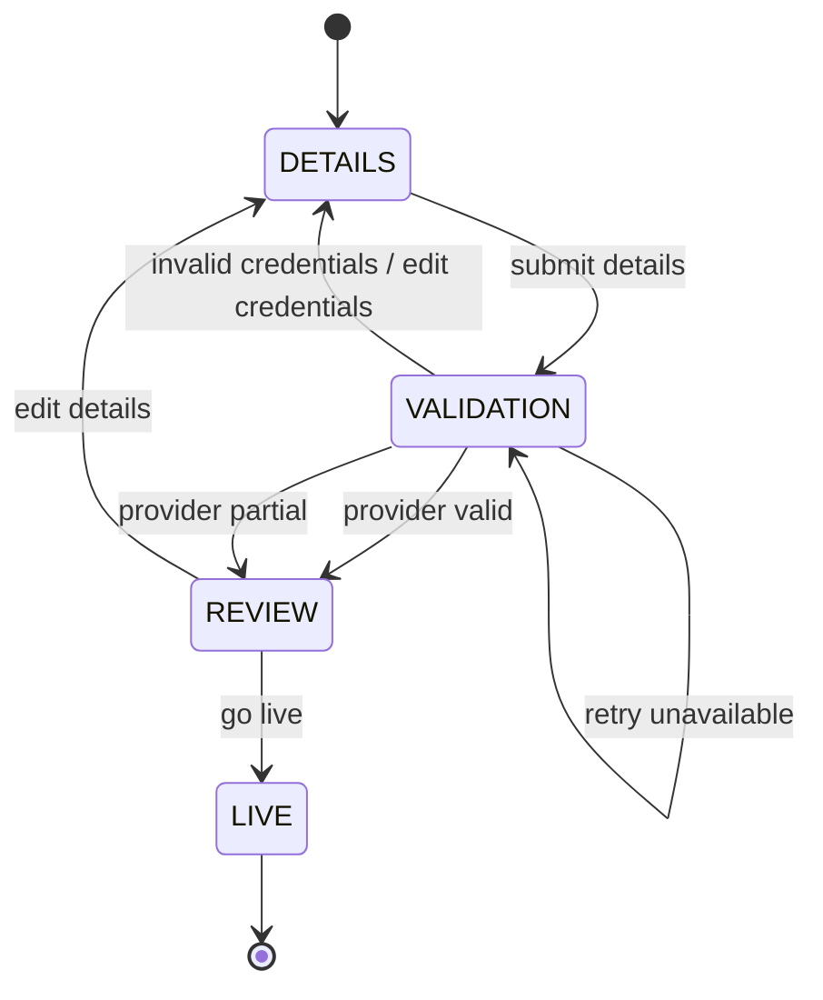

# Itinera

Itinera is a resumable partner onboarding workflow built as a Kotlin + React + PostgreSQL vertical slice.

It lets a partner company enter Provider credentials, validate the integration, review discovered Provider items, and go live.

## Goals

* Build a coherent end-to-end onboarding slice.
* Keep the backend as the source of truth for workflow state.
* Persist session and step state so the flow survives reloads and server restarts.
* Make Provider validation retry-safe and idempotent.
* Make go-live transactional and idempotent.
* Prefer correctness and clear tradeoffs over feature breadth.

## Tech Stack

Backend:

* Kotlin
* Spring Boot
* PostgreSQL
* Flyway
* NamedParameterJdbcTemplate

Frontend:

* React
* TypeScript

## Running Locally

```bash
docker compose up -d
```

```bash
cd backend
./gradlew bootRun
```

```bash
cd frontend
npm install
npm run dev
```

## Running Tests

```bash
cd backend
./gradlew test
```

Frontend test command:

```bash
cd frontend
npm test
```

## Workflow



## Design Summary

Itinera uses a fixed three-step onboarding workflow for the submitted slice:

1. Details
2. Validate Integration
3. Review & Go Live

The implementation intentionally does not build a dynamic form engine. Instead, it keeps the workflow simple while preserving extension seams for future configurable onboarding flows.

The backend owns the workflow state and returns the current step and allowed actions to the frontend. The frontend renders that state and never invents transitions locally.

## Persistence Model

The database uses a hybrid relational + JSONB design:

* `onboarding_session` stores the session lifecycle.
* `onboarding_step_state` stores per-step resumable payloads.
* `provider_validation_attempt` stores validation audit history.
* `partner_account` stores the final live account.

Step payloads are stored as JSONB, while Kotlin DTOs and application-level validation keep payloads type-safe within the application boundary.

## Provider Mock

The Provider integration is modeled behind a `ProviderValidationPort`.

For this slice, the implementation uses an in-process fake Provider. It supports:

* valid credentials
* partial result with warnings
* invalid credentials
* temporary unavailable
* timeout

The fake keeps the project focused on workflow correctness rather than infrastructure.

## API Key Handling

Provider credentials are persisted to support resumability.

The API key is never returned by the API. Session responses expose only whether an API key is present and a masked value for display.

A production implementation would encrypt credentials at rest using a KMS or secrets-manager-backed strategy.

## Idempotency

The implementation treats these operations as idempotent:

* Submitting details multiple times updates the details state.
* Retrying validation records a new attempt but safely replaces the latest validation result.
* Calling go-live multiple times does not duplicate the partner account.

## Deliberately Deferred

* Authentication and authorization.
* Real Provider integration.
* Dynamic workflow/form configuration from the database.
* Separate Provider mock service.
* CI/CD.
* Production Docker images.
* Advanced frontend styling.

## With Another Day

* Add OpenAPI generation and frontend type generation.
* Add a database-backed workflow definition.
* Encrypt Provider credentials at rest.
* Add Testcontainers for PostgreSQL integration tests.
* Add Playwright smoke tests for the wizard.
* Add a separate mock Provider HTTP service.
* Improve UI accessibility and validation messaging.

## AI Interaction Log

See `AI_LOG.md` and `docs/agents/`.

The project uses AI as an engineering assistant, not as an unchecked code generator. Tasks, reports, review feedback, accepted changes, rejected changes, and human corrections are documented there.

