# Itinera

Itinera is a resumable partner-onboarding vertical slice built with Kotlin, React, and PostgreSQL. A partner enters Provider credentials, validates the integration, reviews discovered items and warnings, and goes live. The backend owns every workflow transition; the frontend renders the session state and `allowedActions` returned by the API.

## Implemented Vertical Slice

The repository contains the complete development flow:

- persisted onboarding sessions and versioned JSONB step state
- backend-owned `DETAILS → VALIDATION → REVIEW → COMPLETE` workflow
- deterministic in-process Provider fake with auditable validation attempts
- transactional, idempotent go-live and partner-account creation
- REST API with uniform session and error responses
- React wizard with reload/resume through `localStorage`
- Docker Compose runtime for PostgreSQL, backend, and frontend
- backend unit and PostgreSQL-backed integration tests

Authentication, a real Provider HTTP client, and production infrastructure are intentionally outside this slice.

## Tech Stack

- **Backend:** Kotlin 2.1.21, Spring Boot 3.5, Gradle, Spring JDBC (`NamedParameterJdbcTemplate`)
- **Database:** PostgreSQL 16, Flyway, relational lifecycle data plus JSONB step payloads
- **Frontend:** React 18, TypeScript, Vite 6
- **Local runtime:** Docker Compose, multi-stage JDK/JRE and Node/nginx images

## Quick Start — Full Stack with Docker

Requirements: Docker with Compose support.

```bash
docker compose up --build
```

Open [http://localhost:3000](http://localhost:3000). The frontend proxies `/api` to the backend; the backend is also exposed on `http://localhost:8080`, and PostgreSQL on port `5432`.

Stop the stack with:

```bash
docker compose down
```

Add `-v` only when you intentionally want to delete the local PostgreSQL volume.

## Development Mode

The backend requires **JDK 21**. Kotlin targets JVM 21, and this project has encountered startup incompatibilities under JDK 25+. Verify with `java -version`; on macOS, JDK 21 can be installed with `brew install openjdk@21`.

Start PostgreSQL:

```bash
docker compose up -d postgres
```

Run the backend from one terminal:

```bash
cd backend
./gradlew bootRun
```

Run the frontend from another:

```bash
cd frontend
npm install
npm run dev
```

Open [http://localhost:5173](http://localhost:5173). Vite proxies `/api` to `http://localhost:8080`.

## Tests and Build Checks

Backend tests use the local PostgreSQL database:

```bash
docker compose up -d postgres
cd backend
./gradlew test
```

Run one backend test class:

```bash
cd backend
./gradlew test --tests "com.qualitara.itinera.api.OnboardingApiIntegrationTest"
```

The frontend does not yet have an automated test suite. Its type and production-build check is:

```bash
cd frontend
npm install
npm run build
```

## Provider Mock Trigger Values

Enter one of these exact values as `accountId`; the API key can be any non-blank value:

| `accountId` | Result | Observable behavior |
|---|---|---|
| `valid` | `VALID` | Returns two active Provider items and advances to review. |
| `partial` | `PARTIAL` | Returns one item plus warnings and allows go-live. |
| `invalid` | `INVALID` | Returns a rejection reason and sends the session back to details. |
| `unavailable` | `UNAVAILABLE` | Leaves validation retryable. |
| `timeout` | `TIMEOUT` | Simulates a transport timeout and leaves validation retryable. |

Any other account ID returns `INVALID`. Trigger matching is case-sensitive.

The raw API key is accepted when details are submitted and must be entered again for each validation attempt. It is held only for the active request and is never persisted or returned. The backend stores a masked display value and a SHA-256 credential fingerprint so it can detect credential changes without retaining the secret.

## Workflow

```mermaid
stateDiagram-v2
    [*] --> DETAILS
    DETAILS --> VALIDATION: submit details
    VALIDATION --> REVIEW: valid or partial
    VALIDATION --> DETAILS: invalid
    VALIDATION --> VALIDATION: unavailable or timeout; retry
    REVIEW --> VALIDATION: credentials changed; mark stale
    REVIEW --> COMPLETE: go live
    COMPLETE --> [*]
```



`COMPLETE` is the terminal workflow step; `LIVE` is the completed session/account status. A completed session cannot be reopened through onboarding.

## Key Design Decisions

- **Backend-owned workflow:** API responses include `currentStep`, `validationStatus`, and `allowedActions`; the UI does not invent transitions.
- **Hybrid persistence:** relational columns hold identity and lifecycle fields, while typed, versioned JSONB stores step payloads.
- **Explicit SQL:** repositories use `NamedParameterJdbcTemplate`; JPA is intentionally absent.
- **Provider port:** `ProviderValidationPort` isolates the deterministic fake from a future HTTP client.
- **Auditable validation:** every attempt is recorded; the latest result is upserted as resumable step state.
- **Transactional go-live:** partner-account creation and session completion commit together; repeat calls do not create duplicates.
- **Write-only secrets:** raw API keys are neither persisted nor returned.

See [Architecture](docs/ARCHITECTURE.md), [API Contract](docs/API_CONTRACT.md), [Database ER Model](docs/DB_ER.md), and [ADRs](docs/adr/).

## Tradeoffs

- Provider validation currently runs inside one database transaction because the fake is synchronous and in-process. A real network call should persist `PENDING`, call outside the transaction, then commit the outcome separately.
- Backend integration tests depend on a locally running PostgreSQL instance instead of Testcontainers.
- Backend and frontend DTOs are mirrored manually; OpenAPI/type generation is deferred.
- The frontend deliberately uses local component state and has no automated test framework.
- Docker images are evaluator-friendly local images, not hardened production artifacts.

## Deferred Work

Authentication and authorization, a real Provider HTTP client, encrypted credential-vault integration, dynamic workflow definitions, Testcontainers, frontend tests, generated API types, CI, and production hardening are tracked in [Future Forwards](docs/FUTURE_FORWARDS.md).

## With Another Day

1. Add Testcontainers so backend tests are self-contained.
2. Add Vitest/Testing Library coverage for resume, retries, and redaction-sensitive UI behavior.
3. Generate OpenAPI plus TypeScript types to remove DTO drift.
4. Add CI for backend tests, frontend build/tests, and container builds.
5. Prototype the real Provider client with the split-transaction validation design.

## AI-Assisted Delivery

The [AI interaction log](AI_LOG.md) indexes task briefs and completion reports under [`docs/agents/tasks/`](docs/agents/tasks/) and [`docs/agents/reports/`](docs/agents/reports/). It records planning, implementation, review findings, corrections, and final documentation rather than presenting AI output as unchecked code generation.
