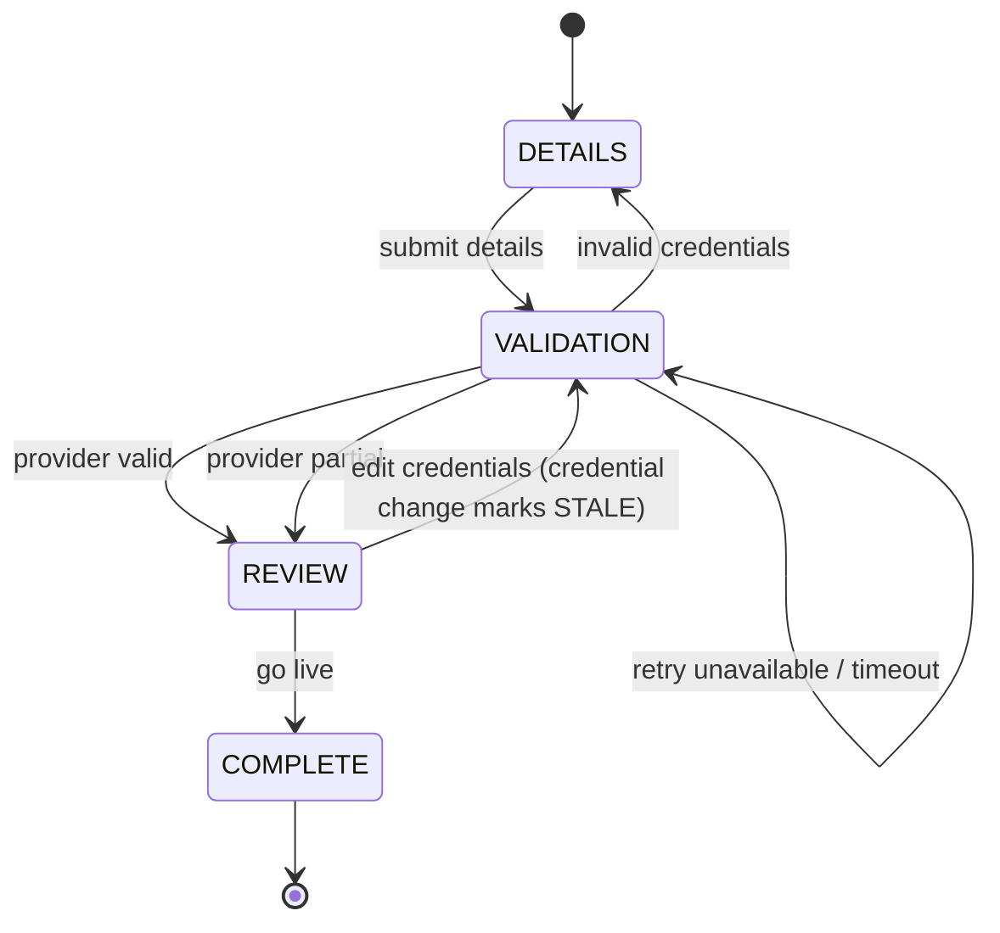

# Itinera Architecture

## Overview

Itinera is a resumable partner onboarding workflow implemented as a Kotlin + React + PostgreSQL vertical slice.

The system lets a partner company:

1. Enter company and Provider credentials.
2. Validate the Provider integration.
3. Review discovered Provider items.
4. Go live.

The central architectural concern is not the wizard UI itself, but the reliable handling of workflow state, resumability, idempotency, Provider failures, and the final go-live transition.

## Architectural Goals

* Keep the backend as the source of truth for workflow state.
* Make the onboarding flow resumable across page reloads and backend restarts.
* Keep the submitted workflow fixed and simple.
* Preserve extension seams for future dynamic workflows.
* Make Provider validation safe to retry.
* Make go-live idempotent and transactional.
* Prefer explicit SQL and migrations over hidden persistence behavior.
* Add tests alongside each implementation slice.

## System Shape

```text
React Frontend
      |
      | HTTP/JSON
      v
Kotlin Spring Boot API
      |
      | Port
      v
ProviderValidationPort
      |
      v
FakeProviderValidationClient

Kotlin Spring Boot API
      |
      v
PostgreSQL
```

The frontend communicates only with the Itinera API. It does not call the Provider directly.

For the take-home slice, the Provider is implemented as an in-process fake behind a port. This keeps the focus on workflow correctness and retry behavior rather than infrastructure.

## Backend Source of Truth

The backend owns:

* current onboarding step
* session status
* step payloads
* validation status
* allowed actions
* go-live eligibility

The frontend renders the state returned by the backend. It may keep temporary form state locally, but it must not decide workflow transitions on its own.

A typical session response should include enough information for the frontend to render the correct screen after a reload:

```json
{
  "sessionId": "...",
  "currentStep": "VALIDATION",
  "status": "DRAFT",
  "details": {
    "companyName": "Acme Inc.",
    "accountId": "valid-account",
    "apiKeyPresent": true,
    "apiKeyMasked": "********"
  },
  "validation": {
    "status": "PARTIAL",
    "items": [],
    "warnings": []
  },
  "allowedActions": [
    "EDIT_DETAILS",
    "RETRY_VALIDATION",
    "GO_TO_REVIEW"
  ]
}
```

## Workflow Model

The submitted slice uses a fixed three-step workflow:

1. `DETAILS`
2. `VALIDATION`
3. `REVIEW`
4. `LIVE`

The flow is intentionally not implemented as a dynamic form engine. Three fixed steps are sufficient for the prompt and keep the project focused.

The workflow rules should still be isolated behind a small domain boundary so that a future implementation could load workflow definitions from PostgreSQL.

```text
WorkflowDefinitionPort
        |
        +-- StaticWorkflowDefinition
        |
        +-- DatabaseWorkflowDefinition     future-forward
```

## Workflow Diagram



## Important Workflow Rules

### Submit Details

`DETAILS` is the initial data-entry step. Submitting details advances the session to `VALIDATION`.

Submitting details is idempotent. Re-submitting with the same credentials preserves existing workflow state.

BR-001: if `accountId` or `apiKey` changes after a prior validation, the previous result is invalidated. The workflow returns to `VALIDATION` with status `STALE`. Editing credentials does not return the session to `DETAILS`; it only marks validation as untrusted and requires re-validation before go-live.

### Validate Integration

Validation calls the Provider through `ProviderValidationPort`.

Validation is retry-safe:

* A new attempt may be recorded each time.
* The latest validation result replaces the current validation step state.
* Failed transient attempts must not corrupt previously stored details.
* Unavailable or timeout responses must leave the user able to retry.

Provider outcomes:

* `VALID`: persist items, allow review.
* `PARTIAL`: persist items and warnings, allow review.
* `INVALID`: persist reason, allow editing credentials.
* `UNAVAILABLE` / `TIMEOUT`: persist transient status, allow retry.

### Review and Go Live

Go-live is allowed only when the latest validation result is `VALID` or `PARTIAL`.

Go-live must be transactional:

* create or reuse the partner account
* mark the partner account live
* mark the onboarding session complete

Calling go-live more than once must not create duplicate partner accounts.

## Persistence Architecture

Itinera uses PostgreSQL with Flyway migrations.

The persistence model is hybrid relational + JSONB:

* relational columns model lifecycle, identity, status, and constraints
* JSONB payloads store per-step data that can evolve over time

This avoids schema churn for every future onboarding step while keeping the core lifecycle explicit.

### Core Tables

```text
onboarding_session
- id
- current_step
- status
- created_at
- updated_at
- completed_at
```

```text
onboarding_step_state
- id
- session_id
- step_key
- status
- payload jsonb
- created_at
- updated_at
- completed_at

unique(session_id, step_key)
```

```text
provider_validation_attempt
- id
- session_id
- attempt_number
- account_id
- request_fingerprint
- outcome
- response_payload jsonb
- error_message
- started_at
- completed_at
```

```text
partner_account
- id
- session_id unique
- company_name
- status
- went_live_at
- created_at
```

## JSONB Payload Strategy

Step payloads are stored as JSONB, but the application must not treat them as untyped maps everywhere.

Each step should have a typed Kotlin payload DTO:

```text
DetailsPayload
ValidationPayload
ReviewPayload
```

The service layer is responsible for validating payload shape and business rules before persisting.

A future implementation could add JSON Schema validation for versioned payloads.

## Workflow Domain Package

The `com.qualitara.itinera.workflow` package owns all onboarding workflow rules. It does not own HTTP, SQL, Provider calls, or frontend state.

Key components:

```text
AllowedActionCalculator     — pure component: step + validationStatus → Set<AllowedAction>
OnboardingWorkflowService   — service: owns all state transitions and logs decisions
CredentialFingerprint       — computes SHA-256 fingerprint of accountId:apiKey for BR-001
ValidationStatus            — workflow-level status enum (adds NOT_STARTED, PENDING, STALE)
AllowedAction               — enum of actions the frontend may offer (SUBMIT_DETAILS, etc.)
WorkflowSessionState        — domain model: current step + validationStatus + fingerprint
```

Sub-packages:

- `workflow.payload` — typed step payload DTOs (DetailsPayload, ValidationPayload, ReviewPayload, ProviderItem)
- `workflow.model` — WorkflowSessionState
- `workflow.exception` — InvalidWorkflowTransitionException, UnsupportedPayloadVersionException

All transition methods in `OnboardingWorkflowService` are pure: they accept a state, validate preconditions, and return a new state. The caller (API layer) is responsible for loading from and persisting to the repositories.

### BR-001: Credential Change Invalidates Validation

When a partner resubmits details with a changed `accountId` or API key, `OnboardingWorkflowService.applyDetailsSubmission` detects the fingerprint change and sets `validationStatus = STALE`, forcing re-validation before go-live is allowed.

## Provider Integration

The Provider is represented by a port:

```kotlin
interface ProviderValidationPort {
    fun validate(request: ProviderValidationRequest): ProviderValidationResult
}
```

For this slice:

```text
FakeProviderValidationClient
```

Future-forward alternatives:

```text
HttpProviderValidationClient
GrpcProviderValidationClient
WireMock-backed integration tests
```

The fake Provider should support deterministic trigger values so each outcome can be manually tested and documented.

## API Contract Direction

The REST API should expose session-oriented operations:

```text
POST /api/onboarding/sessions
GET  /api/onboarding/sessions/{sessionId}
PUT  /api/onboarding/sessions/{sessionId}/details
POST /api/onboarding/sessions/{sessionId}/validate
POST /api/onboarding/sessions/{sessionId}/go-live
```

Responses should be DTOs aligned with frontend TypeScript types.

A future implementation could generate TypeScript types from OpenAPI.

For this slice, manually mirrored DTOs are acceptable if the contract remains small and clear.

## Frontend Architecture

The frontend is a fixed three-step wizard:

```text
DetailsStep
ValidationStep
ReviewStep
```

The frontend should:

* store only `sessionId` in `localStorage`
* fetch the session from the backend on load
* render based on backend `currentStep` and `allowedActions`
* keep form input locally only until submitted
* show validation outcomes clearly
* allow retry when validation is unavailable or timed out

The frontend should not:

* independently advance steps without backend confirmation
* call the mock Provider directly
* store the API key after submission

## Testing Strategy

Tests should be added with each implementation slice.

Priority:

1. Workflow transition tests.
2. Provider outcome mapping tests.
3. Persistence tests for resumability.
4. Idempotency tests for details, validation retry, and go-live.
5. Frontend smoke tests if time allows.

The project should avoid coverage farming. The tests should prove the behaviors the prompt evaluates.

## Key Tradeoffs

### Fixed Workflow vs Dynamic Workflow Engine

Decision:

Use a fixed workflow in code for the submitted slice.

Reason:

The prompt defines exactly three steps. A dynamic workflow engine would distract from the evaluated concerns.

Future-forward:

Load workflow steps and transitions from PostgreSQL through a `DatabaseWorkflowDefinition`.

### JSONB Step Payloads vs Fully Relational Step Tables

Decision:

Use JSONB payloads for step-specific data.

Reason:

This keeps the schema adaptable while preserving relational lifecycle constraints.

Tradeoff:

The database enforces fewer field-level constraints. Kotlin DTOs and service validation compensate.

### In-Process Fake Provider vs Separate Mock Service

Decision:

Use an in-process fake behind a port.

Reason:

It exercises all Provider outcomes without spending time on infrastructure.

Future-forward:

Replace with an HTTP mock Provider or external service adapter.

### NamedParameterJdbcTemplate vs JPA

Decision:

Use explicit SQL through `NamedParameterJdbcTemplate`.

Reason:

The model is small, JSONB is central, and transactional behavior should be easy to inspect.

Tradeoff:

More manual mapping code than JPA.

## Deferred Architecture Work

* Auth and multi-partner tenancy.
* Encrypted credential storage.
* Dynamic workflow definitions.
* Versioned JSON Schema validation.
* OpenAPI-generated frontend types.
* Separate Provider service.
* Testcontainers-backed PostgreSQL integration tests.
* Playwright end-to-end wizard tests.
