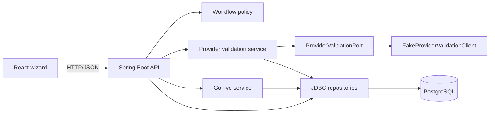

# Itinera Architecture

## System Overview

Itinera is a resumable partner-onboarding vertical slice. The React frontend talks only to the Kotlin/Spring Boot API. The API owns workflow state, persists it in PostgreSQL, validates credentials through a Provider port, and completes onboarding transactionally.



The fake Provider is in-process and deterministic. It can later be replaced by an HTTP adapter without changing workflow rules or the public REST contract.

## Backend-Owned Workflow

```mermaid
stateDiagram-v2
    [*] --> DETAILS
    DETAILS --> VALIDATION: submit details
    VALIDATION --> REVIEW: VALID or PARTIAL
    VALIDATION --> DETAILS: INVALID
    VALIDATION --> VALIDATION: UNAVAILABLE or TIMEOUT; retry
    REVIEW --> VALIDATION: credentials changed; STALE
    REVIEW --> COMPLETE: go live
    COMPLETE --> [*]
```



`DETAILS`, `VALIDATION`, `REVIEW`, and `COMPLETE` are workflow steps. `DRAFT` and `LIVE` are session lifecycle statuses. A completed session is terminal.

Every session response contains `currentStep`, `sessionStatus`, `validationStatus`, and `allowedActions`. The frontend may keep unsent form values locally, but it does not advance the workflow or infer recovery actions.

Important rules:

- Details submission is an upsert. Repeating identical credentials preserves trusted validation state.
- BR-001: changing `accountId` or `apiKey` changes the credential fingerprint, marks validation `STALE`, and returns the workflow to `VALIDATION`.
- Validation follows `startValidation → PENDING → applyValidationOutcome`.
- `VALID` and `PARTIAL` permit go-live; all other validation states block it.
- `UNAVAILABLE` and `TIMEOUT` remain retryable.
- Go-live creates at most one partner account and cannot partially complete.

## Backend Boundaries

### API Layer

`com.qualitara.itinera.api` contains the thin controller, request/response DTOs, exception mapping, and `OnboardingApplicationService`. The application service coordinates repositories and domain/application services, then re-reads persisted state to assemble the authoritative full session response.

Implemented endpoints:

```text
POST /api/onboarding/sessions
GET  /api/onboarding/sessions/{sessionId}
PUT  /api/onboarding/sessions/{sessionId}/details
POST /api/onboarding/sessions/{sessionId}/validation
POST /api/onboarding/sessions/{sessionId}/go-live
```

See [API_CONTRACT.md](API_CONTRACT.md) for request, response, and error examples.

### Workflow Domain

`com.qualitara.itinera.workflow` owns pure business rules:

- `OnboardingWorkflowService` validates and applies transitions.
- `AllowedActionPolicy.resolve` derives the actions exposed to the frontend.
- `CredentialFingerprint` computes the SHA-256 digest used for credential-change detection.
- typed payloads (`DetailsPayload`, `ValidationPayload`, `ReviewPayload`) define stored step shapes.

It does not own HTTP, SQL, Provider transport, or transaction orchestration.

### Provider Validation

`ProviderValidationPort` accepts `ProviderValidationRequest(accountId, apiKey)` and returns `ProviderValidationResult`. `FakeProviderValidationClient` maps exact `accountId` triggers to `VALID`, `PARTIAL`, `INVALID`, `UNAVAILABLE`, or `TIMEOUT`.

`ProviderValidationService`:

1. loads the session and submitted details;
2. persists the latest validation state as `PENDING`;
3. calls the port with the API key supplied to the validation request;
4. inserts an immutable audit attempt containing only a fingerprint, outcome, and safe response data;
5. upserts the latest validation payload;
6. persists any workflow-step change.

For the synchronous in-process fake, these operations use one Spring transaction. A real network adapter must split the transaction so it does not hold database resources during external I/O.

### Transactional Go-Live

`GoLiveService` loads details and the latest validation, delegates eligibility to the workflow domain, creates or reuses the single `partner_account`, and marks the session `COMPLETE/LIVE` in one transaction. An explicit lookup provides clean idempotency; the database unique constraint on `partner_account.session_id` is the structural backstop.

### Persistence

`com.qualitara.itinera.internal.persistence` is an implementation boundary:

- records represent stored rows, not rich domain objects;
- repositories use `NamedParameterJdbcTemplate` and explicit SQL;
- `JsonbPayloadMapper` owns Jackson/JSONB conversion;
- Flyway owns schema evolution.

PostgreSQL enforces types, keys, foreign keys, uniqueness, and storage constraints. Kotlin owns workflow and business rules. See [DB_ER.md](DB_ER.md) and ADRs [0003](adr/0003-hybrid-relational-jsonb-step-state.md), [0004](adr/0004-version-jsonb-payloads-at-application-boundary.md), and [0005](adr/0005-keep-postgresql-as-persistence-boundary.md).

## Persistence and Resume

The storage model is hybrid relational plus JSONB:

- `onboarding_session` stores current step and lifecycle.
- `onboarding_step_state` stores one versioned JSONB payload per session/step.
- `provider_validation_attempt` stores ordered validation audit history.
- `partner_account` stores the live result, unique per session.

The browser stores only `itinera.sessionId`. On reload, it fetches the session and renders the returned state. Details and latest validation survive backend restart because they are reconstructed from persisted step payloads.

## Credential Handling

The raw API key is never persisted, logged, or returned:

- details submission computes and stores a SHA-256 fingerprint plus a masked display value;
- validation requires the user to enter the API key again;
- the validation service holds it only for the active Provider call;
- audit rows contain the request fingerprint, not the key;
- response DTOs explicitly omit both the raw key and fingerprint.

This design avoids plaintext credential storage in the take-home slice. A real product would use an encrypted credential vault if unattended re-validation were required.

## Frontend Architecture

`OnboardingPage` owns lightweight session orchestration:

1. read `itinera.sessionId` from `localStorage`;
2. resume it with `GET`, or create a session if absent/not found;
3. render `DetailsStep`, `ValidationStep`, `ReviewStep`, or completion from `currentStep`;
4. invoke only actions present in `allowedActions`;
5. replace local session state with every full mutation response.

Vite proxies `/api` to the backend in development. The Docker frontend uses nginx for static files, SPA fallback, and the same `/api` reverse proxy.

## Error Model

Expected client errors use:

```json
{
  "code": "INVALID_TRANSITION",
  "message": "The requested action is not valid for the current session state."
}
```

Known mappings are `400 MALFORMED_REQUEST`, `404 SESSION_NOT_FOUND`, `409 INVALID_TRANSITION`, and `422 UNSUPPORTED_PAYLOAD_VERSION`. Provider outcomes such as `INVALID`, `UNAVAILABLE`, and `TIMEOUT` are successful workflow results (`200`), not protocol failures.

## Testing Strategy

- pure workflow tests cover transitions, stale credentials, guards, and allowed actions;
- fake-Provider tests cover deterministic mappings without Spring;
- PostgreSQL-backed tests cover repositories, validation orchestration, go-live transactions, and REST flows;
- end-to-end backend flows cover valid, partial, transient retry, invalid blocking, redaction, and repeated go-live;
- frontend production compilation is enforced with `npm run build`; automated frontend tests remain deferred.

The suite requires a local PostgreSQL instance. Testcontainers and browser-level tests are recorded in [FUTURE_FORWARDS.md](FUTURE_FORWARDS.md).

## Principal Tradeoffs

- A fixed workflow is clearer and faster to verify than a dynamic engine, at the cost of code changes for new steps.
- JSONB reduces schema churn, at the cost of application-owned payload validation and version migration.
- Explicit JDBC is transparent, at the cost of manual row mapping.
- The in-process Provider fake makes outcomes deterministic, but does not exercise HTTP transport behavior.
- Manual DTO mirroring keeps tooling small, but can drift without disciplined contract tests.
