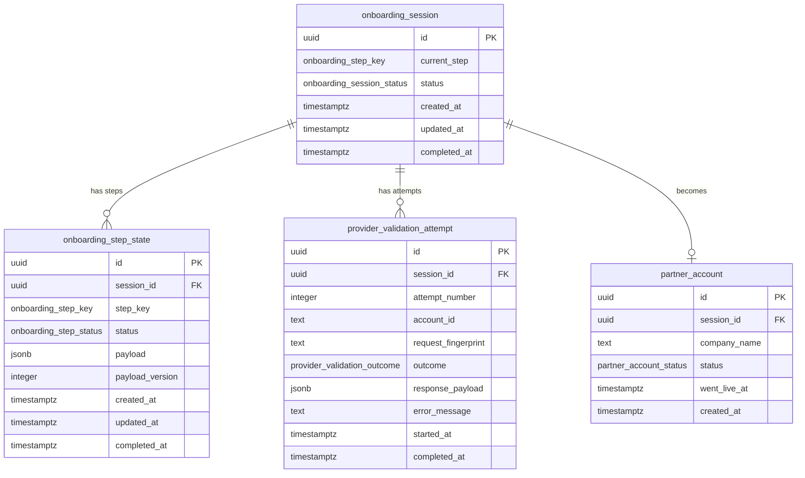

# Database Schema

The persistence model is built around a central `onboarding_session` that tracks where a partner is in the onboarding flow and whether they have gone live. Each session owns a set of `onboarding_step_state` records — one per wizard step — that store the step's current status and its submitted payload as JSONB, allowing the flow to be resumed at any point after a page reload or server restart.

Validation attempts are recorded separately in `provider_validation_attempt`, giving a full audit trail of every call made to the external Provider, including retries and failure outcomes. Once a partner completes the flow, a `partner_account` row is created in the same transaction that marks the session complete, ensuring no half-committed state is possible.

## Enums

| Type | Values |
|---|---|
| `onboarding_step_key` | `DETAILS`, `VALIDATION`, `REVIEW`, `COMPLETE` |
| `onboarding_session_status` | `DRAFT`, `LIVE` |
| `onboarding_step_status` | `NOT_STARTED`, `IN_PROGRESS`, `COMPLETED`, `BLOCKED` |
| `provider_validation_outcome` | `VALID`, `PARTIAL`, `INVALID`, `UNAVAILABLE`, `TIMEOUT` |
| `partner_account_status` | `LIVE` |