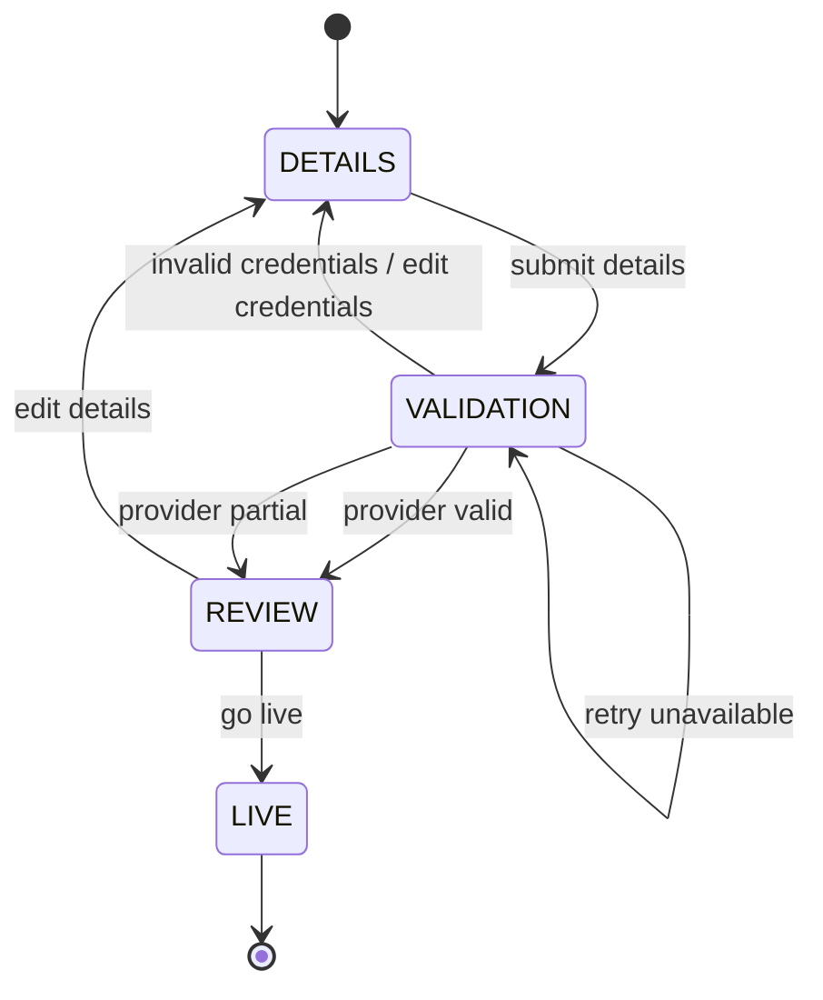

# ADR 0002 — Backend-Owned Static Workflow for the Submitted Slice

## Status

Accepted

## Context

The onboarding prompt defines a three-step flow: Details → Validate integration → Review and go live.

The frontend must support progress tracking and resume. A partner may leave the flow and return later, so the current step and prior input must survive reloads and backend restarts.

A dynamic workflow engine or dynamic form system could be built, but that is not required and would distract from the evaluated behaviors (resumability, idempotency, Provider resilience).

## Decision

Model the submitted workflow as a fixed backend-owned state machine.

The backend owns:

- current step
- session status
- validation status
- allowed actions
- go-live eligibility

The frontend renders the state returned by the backend and does not independently decide workflow transitions.

Workflow rules are isolated behind a small domain boundary so a future implementation could load workflow definitions from PostgreSQL without changing the service API.

## Workflow

## Important Rules

- Submitting details more than once updates the existing details payload (idempotent).
- If credentials change after a valid or partial validation, the previous validation result is invalidated.
- `VALID` and `PARTIAL` Provider results allow proceeding to review.
- `INVALID` requires credential correction before re-validation.
- `UNAVAILABLE` and `TIMEOUT` allow retry without changing step.
- Go-live is allowed only after the latest validation result is `VALID` or `PARTIAL`.
- Go-live is idempotent — calling it more than once must not duplicate the partner account.

## Tradeoffs

**Benefits:**
- Simple, fully testable state machine.
- Clear backend ownership prevents UI-only transitions from corrupting the flow.
- Avoids premature dynamic workflow infrastructure.
- Makes resume behavior deterministic and easy to reason about.

**Costs:**
- New steps require code changes, not configuration.
- Partner-specific workflow variations not supported in this slice.
- Dynamic form rendering is deferred.

## Consequences

The REST API returns current step, status, and `allowedActions`. The frontend stores only `sessionId` in `localStorage` for resume and re-fetches authoritative state from the backend on load.

Future work may introduce a database-backed `WorkflowDefinition` if onboarding becomes configurable per partner or Provider.
