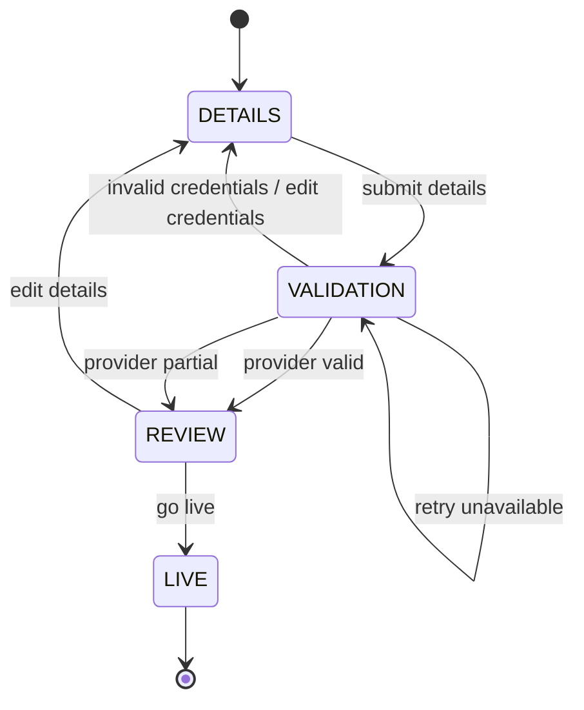

# ADR-0002 — Keep the Onboarding Workflow Backend-Owned and Static for the Submitted Slice

## Status

Accepted

## Context

The onboarding prompt defines a three-step flow:

1. Details
2. Validate integration
3. Review and go live

The frontend must support progress tracking and resume. A partner may leave the flow and return later, so the current step and prior input must survive reloads and backend restarts.

It would be possible to build a dynamic workflow engine or dynamic form system, but that is not required by the prompt and would distract from the evaluated behaviors.

## Decision

Model the submitted workflow as a fixed backend-owned state machine.

The backend owns:

* current step
* session status
* validation status
* allowed actions
* go-live eligibility

The frontend renders the state returned by the backend and does not independently decide workflow transitions.

The workflow rules will be isolated behind a small domain boundary so a future implementation could load workflow definitions from PostgreSQL.

## Rationale

A fixed workflow is sufficient for the three-step prompt and keeps the implementation focused on correctness, resumability, idempotency, and integration resilience.

Making the backend the source of truth prevents UI-only transitions from corrupting the flow.

Keeping the workflow logic isolated preserves an extension point without prematurely building a configurable workflow engine.

## Workflow

## Important Rules

* Submitting details more than once updates the existing details payload.
* If credentials change after validation, the previous validation result is invalidated.
* `VALID` and `PARTIAL` Provider results allow review.
* `INVALID` requires credential correction.
* `UNAVAILABLE` and `TIMEOUT` allow retry.
* Go-live is allowed only after the latest validation result is `VALID` or `PARTIAL`.
* Go-live is idempotent.

## Tradeoffs

### Benefits

* Simple and testable.
* Clear backend ownership.
* Avoids unnecessary dynamic workflow infrastructure.
* Keeps frontend implementation small.
* Makes resume behavior deterministic.

### Costs

* New steps require code changes.
* Partner-specific workflow variations are not supported in this slice.
* Dynamic form rendering is deferred.

## Consequences

The REST API should return session state and allowed actions.

The frontend should store only the session id for resume and re-fetch authoritative state from the backend.

Future work may introduce a database-backed workflow definition if onboarding becomes configurable by partner, Provider, or product.
